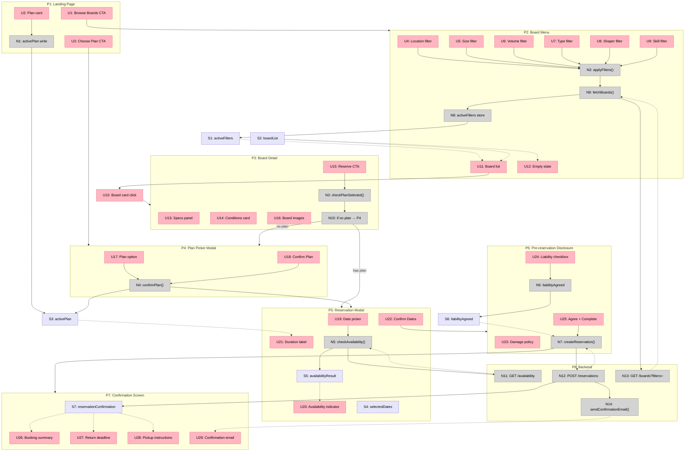

# Surf Club — Shaping

---

## Frame

### Problem

Surfers who travel — or whose boards don't match today's conditions — have no easy way to access the right surfboard. Carrying boards on flights is expensive and inconvenient. When conditions are good and the right equipment isn't at hand, the session is lost.

### Who Is Impacted

Traveling surfers and surfers whose current boards aren't suited for the day's wave conditions. These are people who want to surf but face a logistics or equipment barrier, not a motivation one.

### Outcome

A surfer anywhere can quickly find, reserve, and pick up a surfboard that fits the conditions and their skill level — without owning it, carrying it, or paying airline fees for it. They use it and return it. The business wins if they come back.

---

## Context

This is a new product, built from scratch by a solo designer-engineer. There is no existing system to migrate. The appetite is **one day**, with one buffer day available if the timeline blows.

A direct precedent exists: **Surf's Up Club** already solves this problem in the market. This build is not replacing it — it's testing whether a similar product can be shaped, built, and validated quickly. The primary risk is not technical; it is whether users sign up. If they do, retention is the hypothesis being tested: people who try it return.

---

## Requirements (R)

| ID | Requirement | Status |
|----|-------------|--------|
| R0 | Surfer can browse available surfboards filtered by location, size, volume, type, and shaper | Core goal |
| R1 | Surfer can view board specs and see which conditions each board is suited for | Must-have |
| R2 | Surfer can reserve a board for a date range matching their plan's duration | Must-have |
| R3 | Hero / landing page explains the process clearly enough that a new visitor understands how it works without asking | Must-have |
| R4 | Surfer can choose a plan (day rental, monthly, 3-month, annual) before or during reservation | Must-have |
| R5 | The experience is seamless: pick up on the reserved date, use, and return | Must-have |
| R6 | If no one signs up, the product surface area is small enough that the cause can be diagnosed | Nice-to-have |
| R7 | The reservation UX should feel like booking a room — familiar, low-friction, date-based | Must-have |
| R8 | Boards are locatable by city or town — not just by filter tag alone | Must-have |
| R9 | Damage, liability, and board condition policy is communicated before reservation | Must-have |

> **R9 added from benchmark** — see Benchmark section. Every working board rental operation surfaces damage and insurance handling before the user commits. Its absence is a common silent churn and support ticket source.

---

## Business Model

Four ways to hire a surfboard:

| Plan | Price | Duration per use |
|------|-------|-----------------|
| Day rental | — | 1 day |
| Monthly | $289 / mo | Up to 7 days per cycle |
| 3-month | $199 / mo | Up to 5 days per cycle |
| Annual | $149 / mo | Up to 3 days per cycle |

The retainer plans are the business priority. Day rental exists to reduce signup friction, not as the primary revenue model.

---

## Shape A: Single-session Website — Browse, Pick, Reserve

The complete new build. No existing codebase to migrate from.

| Part | Mechanism | Flag |
|------|-----------|:----:|
| **A1** | **Landing page** — hero section explaining the 3-step loop (browse → reserve → pick up, surf, return); plan pricing section | |
| **A2** | **Board menu** — paginated list of boards with filter sidebar: location (city/town), size, volume, board type, shaper; empty state with location-specific messaging when no boards match | |
| **A3** | **Board detail page** — specs (volume, size, type, shaper, description) + conditions card (best suited for: wave height, swell type, skill level) | |
| **A4** | **Reservation flow** — date picker constrained to plan duration (1 / 3 / 5 / 7 days), availability check, confirm | |
| **A5** | **Plan picker** — shown on landing and as a gate before reservation; sets the date range constraint for A4 | |
| **A6** | **Pre-reservation disclosure** — damage policy, liability acknowledgment, pickup instructions, shown before confirmation | |
| **A7** | **Confirmation screen** — booking summary with pickup date, location, and return deadline | |

---

## Fit Check

| Req | Requirement | Status | A |
|-----|-------------|--------|---|
| R0 | Surfer can browse available surfboards filtered by location, size, volume, type, and shaper | Core goal | ✅ |
| R1 | Surfer can view board specs and see which conditions each board is suited for | Must-have | ✅ |
| R2 | Surfer can reserve a board for a date range matching their plan's duration | Must-have | ✅ |
| R3 | Hero / landing page explains the process clearly enough that a new visitor understands how it works without asking | Must-have | ✅ |
| R4 | Surfer can choose a plan before or during reservation | Must-have | ✅ |
| R5 | The experience is seamless: pick up on the reserved date, use, and return | Must-have | ✅ |
| R6 | If no one signs up, the product surface area is small enough that the cause can be diagnosed | Nice-to-have | ✅ |
| R7 | The reservation UX should feel like booking a room — familiar, low-friction, date-based | Must-have | ✅ |
| R8 | Boards are locatable by city or town — not just by filter tag alone | Must-have | ✅ |
| R9 | Damage, liability, and board condition policy is communicated before reservation | Must-have | ✅ |

Shape A passes all requirements. No failures.

---

## Out of Scope

The following are explicitly excluded from this build cycle:

| Feature | Reason |
|---------|--------|
| User accounts and login | Not needed for a first reservation test |
| Reservation history / dashboard | Post-launch concern |
| Board delivery | Pickup only — showing this clearly prevents confusion |
| Payment processing | Handled manually or via external link for V1 |
| Board inventory management (admin panel) | Boards added manually for V1 |
| Reviews and ratings | Post-launch |
| Waitlist / "notify me" for unavailable boards | Stretch goal — CTA can be added later |
| Multiple board reservations in one session | Single reservation per flow |
| Cancellation and rescheduling flow | Post-launch |

---

## UX Principles

Design constraints that must hold across all screens:

**Clarity over cleverness.** Every screen communicates one thing. The landing page explains the service. The menu finds a board. The detail page shows specs. No screen tries to do too much.

**Familiar reservation patterns.** The booking experience mirrors Airbnb — date picker, availability indicator, confirmation. Users should not need to learn a new interaction model.

**Progressive commitment.** The user can browse boards before choosing a plan. The plan gate only appears when they try to reserve. This lowers the barrier to exploration.

**Seamless return.** Pickup and return logistics must be concrete on the confirmation screen — not "return when done" but "return to [location] by [date/time]."

**Disclose before commit.** Damage and liability terms appear as a mandatory, explicit step before confirmation — not buried in fine print elsewhere.

---

## Open Questions

| # | Question | Impact | Suggested Handling |
|---|----------|--------|--------------------|
| Q1 | Where do surfers pick up and return boards — same location always, or any location? | High — affects confirmation screen copy and user trust | Define pickup/return policy before launch; display explicitly on P7 and in hero |
| Q2 | How is board availability tracked — manual updates or automated? | Medium — affects reliability of the availability check in V4 | Start manual for V1; document the update process |
| Q3 | What happens if a board is returned damaged? | High — legal and financial risk | Damage policy text in P6 must be written with legal review before launch |
| Q4 | Is payment handled in the app or offline? | Medium — affects whether the confirmation flow needs a payment step | V1: reservation only, payment handled separately and documented clearly on P7 |
| Q5 | Will users need an account to manage their reservation? | Low for V1 | Email confirmation (U29, N14) is sufficient; accounts are post-launch |
| Q6 | What if the board menu returns no results for a user's location? | Medium — first impression risk | U12 empty state uses location-specific messaging: "No boards in [city] yet — check back soon or browse nearby locations" |

---

## Benchmark

These are adjacent services and patterns that inform what the market expects and what risks exist beyond what was described.

### Direct Competitor
**Surf's Up Club** is the named existing solution. It validates that the market exists and that the model works. The goal of this build is not to beat it — it's to test whether the shape can be validated quickly by a solo designer-engineer.

### Adjacent Models and What They Teach

| Reference | Model | What It Adds to Radar |
|-----------|-------|----------------------|
| **Airbnb** | Date-based reservation for physical assets | UX model explicitly referenced — familiar to users, sets expectation of date picker + availability calendar + host communication |
| **Zipcar / Lime** | Subscription access to physical assets, pick up and return | Reinforces that the return loop must be crystal clear; users churn when the return feels ambiguous |
| **Wetsuit / kiteboard rental operations** | Local gear rental with skill-level matching | Boards are not one-size-fits-all; shops that don't ask skill level get returns and unhappy sessions — **skill level filter is worth considering even if scoped out for V1** |
| **BoardCave / Pukas surf** | Surfboard spec pages | Sets expectations for what "specs" means: volume, length, width, thickness, tail shape, fin setup, rocker profile |
| **HERO Surf** | Traveling surfer concierge + gear delivery | Some users expect delivery-to-hotel; even showing "pickup only" clearly prevents support tickets |
| **Fat Bikes / ski rental SaaS** | Seasonal gear rental with damage deposits | **Damage deposit or waiver is a near-universal requirement in the gear rental space.** Its absence is one of the top causes of post-session disputes |

### Indicators Likely Out of Radar

These are signals that appear consistently across gear rental services but were not mentioned in the session. They are not required to launch, but their absence creates friction or risk in production:

| Indicator | Why It Matters | Suggested Handling for V1 |
|-----------|---------------|--------------------------|
| **Damage / liability policy** | Users need to know what happens if they ding a board. Operators get hit with chargebacks and disputes without it. | Add to A6 (pre-reservation disclosure) — a single screen with clear terms before confirm |
| **Skill level filter** | A 7'6" longboard and a 5'10" shortboard are not interchangeable. Beginners renting advanced boards = bad session + return. | Add as an optional filter on A2; can be a simple tag (beginner / intermediate / advanced) |
| **Availability state** | What happens when a board is already reserved on the user's dates? If the menu shows unavailable boards, users get frustrated. | Filter the board menu by availability for the selected date range — even a basic version of this reduces support load |
| **Waitlist / out-of-stock** | Popular boards in a location will be claimed. Without a waitlist, the user disappears. | Stretch goal: "Notify me when available" CTA on unavailable boards |
| **What "seamless return" means operationally** | The transcript says the experience should be seamless. But where does the surfer return the board — same location? Any location? | This needs to be explicit on the confirmation screen (A7) and in the hero (A1) |
| **Plan-gating the reservation** | If a user hasn't chosen a plan, the reservation date range is undefined. The flow needs a clear gate or a way to pick plan inline before the calendar appears. | A5 handles this — make sure the plan is confirmed before the date picker activates |

---

## Breadboard: Detail A

### Places

| # | Place | Description |
|---|-------|-------------|
| P1 | Landing Page | Hero, process explanation, plan picker |
| P2 | Board Menu | Filterable list of available boards |
| P3 | Board Detail | Specs, conditions, reserve CTA |
| P4 | Plan Picker Modal | Choose rental plan (blocks interaction with P3 until resolved) |
| P5 | Reservation Modal | Date picker, availability, summary |
| P6 | Pre-reservation Disclosure | Damage policy + liability gate |
| P7 | Confirmation Screen | Booking summary, pickup details, return date |
| P8 | Backend | Availability, reservation creation, board data |

---

### UI Affordances

| # | Place | Component | Affordance | Control | Wires Out | Returns To |
|---|-------|-----------|------------|---------|-----------|------------|
| U1 | P1 | hero | "Browse Boards" CTA | click | → P2 | — |
| U2 | P1 | plan-section | plan card (day / monthly / 3-mo / annual) | click | → N1 | — |
| U3 | P1 | plan-section | "Choose plan" CTA | click | → P4 | — |
| U4 | P2 | board-menu | location filter (city/town) | select | → N2 | — |
| U5 | P2 | board-menu | size filter | select | → N2 | — |
| U6 | P2 | board-menu | volume filter | select | → N2 | — |
| U7 | P2 | board-menu | type filter | select | → N2 | — |
| U8 | P2 | board-menu | shaper filter | select | → N2 | — |
| U9 | P2 | board-menu | skill level filter | select | → N2 | — |
| U10 | P2 | board-card | board card | click | → P3 | — |
| U11 | P2 | board-menu | board list | render | — | — |
| U12 | P2 | board-menu | empty state ("No boards in [city] yet — check back soon or browse nearby") | render | — | — |
| U13 | P3 | board-detail | specs panel (volume, size, type, shaper, description) | render | — | — |
| U14 | P3 | board-detail | conditions card (wave height, swell, skill level) | render | — | — |
| U15 | P3 | board-detail | "Reserve This Board" CTA | click | → N3 | — |
| U16 | P3 | board-detail | board images | render | — | — |
| U17 | P4 | plan-picker-modal | plan option (day / monthly / 3-mo / annual) | click | → N1 | — |
| U18 | P4 | plan-picker-modal | "Confirm Plan" button | click | → N4 | — |
| U19 | P5 | reservation-modal | date picker | select | → N5 | — |
| U20 | P5 | reservation-modal | availability indicator | render | — | — |
| U21 | P5 | reservation-modal | duration label (3 / 5 / 7 days based on plan) | render | — | — |
| U22 | P5 | reservation-modal | "Confirm Dates" button | click | → P6 | — |
| U23 | P6 | disclosure | damage policy text | render | — | — |
| U24 | P6 | disclosure | liability checkbox | check | → N6 | — |
| U25 | P6 | disclosure | "I Agree — Complete Reservation" button | click | → N7 | — |
| U26 | P7 | confirmation | booking summary (board, dates, location) | render | — | — |
| U27 | P7 | confirmation | return deadline | render | — | — |
| U28 | P7 | confirmation | pickup instructions | render | — | — |
| U29 | P7 | confirmation | confirmation email (sent to user) | render | — | — |

---

### Code Affordances

| # | Place | Component | Affordance | Control | Wires Out | Returns To |
|---|-------|-----------|------------|---------|-----------|------------|
| N1 | P1/P4 | plan-store | `activePlan` | write | — | → U21, → N5 |
| N2 | P2 | board-menu | `applyFilters()` | call | → N9 | — |
| N3 | P3 | board-detail | `checkPlanSelected()` | call | → N10 | — |
| N4 | P4 | plan-picker-modal | `confirmPlan()` | call | → N1 | → P5 |
| N5 | P5 | reservation-modal | `checkAvailability()` | call | → N11 | — |
| N6 | P6 | disclosure | `liabilityAgreed` | write | — | → N7 |
| N7 | P6 | disclosure | `createReservation()` | call | → N12, → P7 | — |
| N8 | P2 | board-menu | `activeFilters` | write | — | → U11, → U12 |
| N9 | P2 | board-menu | `fetchBoards()` | call | → N13 | → N8 |
| N10 | P3 | board-detail | if no plan selected | conditional | → P4, → P5 | — |
| N11 | P8 | availability-service | `GET /availability` | call | — | → N5, → U20 |
| N12 | P8 | reservation-service | `POST /reservations` | call | → N14 | → N7 |
| N13 | P8 | board-service | `GET /boards?filters=` | call | — | → N9 |
| N14 | P8 | email-service | `sendConfirmationEmail()` | call | — | → U29 |

---

### Data Stores

| # | Place | Store | Description |
|---|-------|-------|-------------|
| S1 | P2 | `activeFilters` | Current filter state (location, size, volume, type, shaper, skill) |
| S2 | P2 | `boardList` | Fetched boards matching current filters |
| S3 | P1/P4 | `activePlan` | User's selected plan (day / monthly / 3-mo / annual) |
| S4 | P5 | `selectedDates` | Start/end dates chosen by user |
| S5 | P5 | `availabilityResult` | Board availability for selected dates |
| S6 | P6 | `liabilityAgreed` | Boolean — has user accepted damage/liability terms |
| S7 | P7 | `reservationConfirmation` | Confirmed booking data (board, dates, pickup location, return deadline) |

---

### Mermaid Diagram

---

## Slices

| # | Slice | Mechanism | Parts | Demo |
|---|-------|-----------|-------|------|
| V1 | Landing page + plan picker | A1, A5 | U1–U3, U17–U18, N1, N4, S3 | "Visitor sees the product, picks a plan" |
| V2 | Board menu with filters | A2 | U4–U12, N2, N8, N9, N13, S1, S2 | "Filter by location + type, boards appear" |
| V3 | Board detail page | A3 | U13–U16 | "Click a board, see specs and conditions" |
| V4 | Reservation flow + availability | A4 | U19–U22, N5, N11, S4, S5 | "Pick dates, see if the board is available" |
| V5 | Disclosure + confirmation | A6, A7 | U23–U29, N6, N7, N12, N14, S6, S7 | "Agree to terms, get confirmation screen and confirmation email" |

Each slice ends in demo-able UI. V1–V3 can be built as static content in day 1. V4–V5 require backend and represent day 2 (the buffer).
